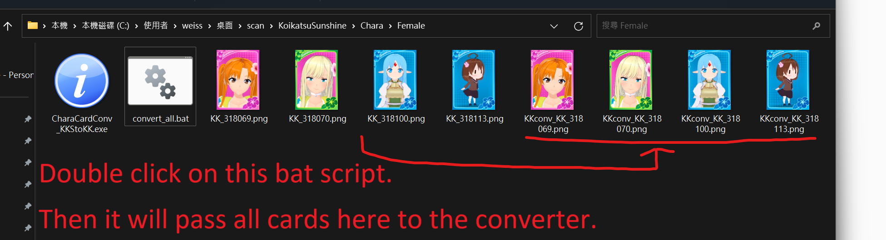

# batch-call-CharaCardConv_KKStoKK
A simple script to find all the cards in the current folder, and then pass them one by one to CharaCardConv_KKStoKK.exe for execution.

## Usage



First, you'll need CharaCardConv_KKStoKK.exe, of course. You can download it [here](https://ux.getuploader.com/KKmod/download/17).

Then put everything together, and run the script.

The script is quite straightforward, as shown below:
```
@echo off
for %%f in (*.png) do (
    start /B CharaCardConv_KKStoKK.exe "%%f" > nul
)
echo All done!
pause
```
